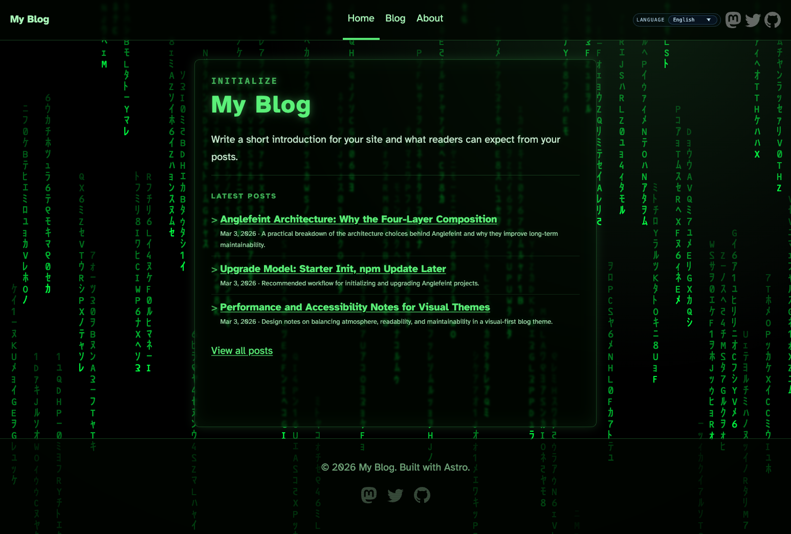
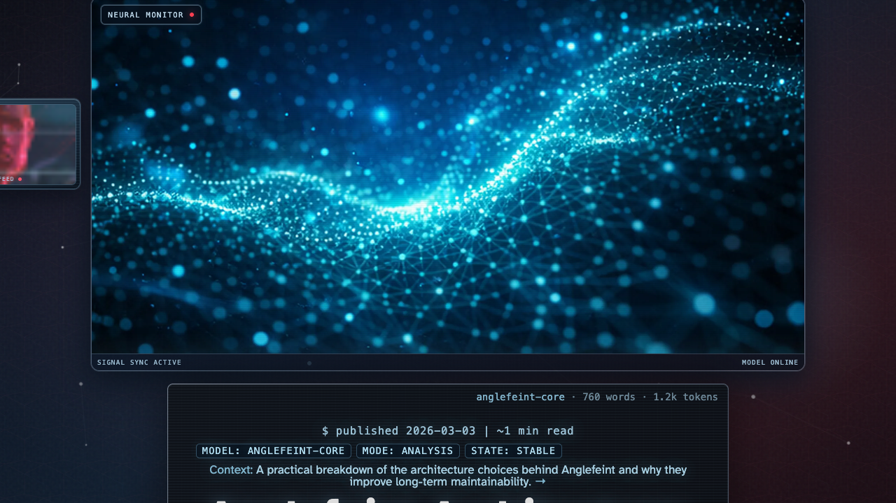
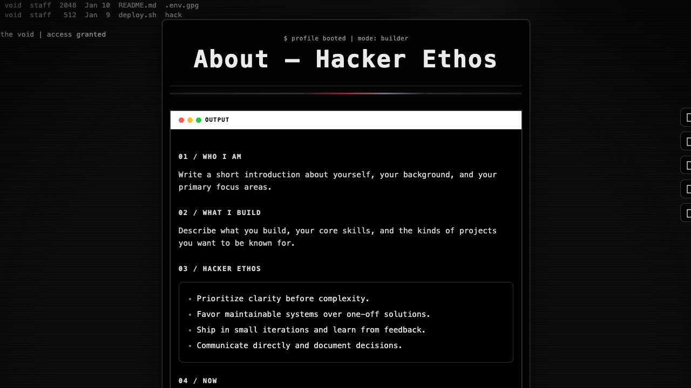

<h1 align="center">cyberdream</h1>
<p align="center">A cyberpunk Astro blog theme built on CYBERCORE CSS.</p>

<p align="center">
  
  
  
  
</p>

## The theme

`cyberdream` is a refurbish of the upstream Anglefeint theme, rebuilt on
[**CYBERCORE CSS**](https://github.com/sebyx07/cybercore-css) (MIT, © 2026
sebyx07), which supplies the design tokens, components and CSS-only effects.
It is installed as an ordinary npm dependency rather than vendored, so it stays
updatable and its licence travels with it.

The theme layer on top lives in one file,
`packages/theme/src/styles/cyberdream.css`, and adds only what a reading-first
blog needs: self-hosted fonts, prose typography, the card and archive grids, and
a few chrome details. CyberCore wraps its rules in `@layer`, so the theme layer
is unlayered and wins without a single `!important`.

What the refurbish changed structurally:

- **Five atmosphere shells became one.** `Ai`, `Base`, `Cyber`, `Hacker` and
  `Matrix` shells, each with its own stylesheet, collapsed into
  `CyberdreamShell`. One surface is far easier to keep accessible and coherent.
- **All bespoke effect JS is gone** — 16 script files covering canvas
  animations, modal systems, a fake decryptor and a read-progress bar. CyberCore
  is CSS-only, so a page now ships exactly one inline script: the locale
  switcher. 21 bespoke stylesheets became one.
- **Headings keep their case.** CyberCore uppercases every heading, which reads
  well on short chrome labels and badly on content — all-caps measurably slows
  reading and is worse again across six languages, where accented Latin loses
  its shape. Chrome labels stay uppercase; anything an author wrote does not.
- **`new-page` lost its `--theme` flag**, since there is one shell. Passing it
  errors rather than being silently ignored.

## This Deployment

Published to <https://blog.ludobermejo.es> from `main` by
`.github/workflows/deploy.yml`, using the GitHub Pages **Actions** source (no
`gh-pages` branch). `public/CNAME` claims the domain; `src/site.config.ts`
declares the origin, and `astro.config.mjs` reads it as `site`.

Two things worth knowing before you change them:

- **The theme lives in `packages/theme/` as an npm workspace**, not in
  `node_modules`. Edit it there. `npm update @cyberdream/astro-theme` will *not*
  update it — the workspace link wins, which is the point.
- **TypeScript is held at `6.x` deliberately.** `npm outdated` will keep
  offering 7.x; taking it breaks `npm run check`. TypeScript 7's native compiler
  does not expose the programmatic API `@astrojs/check` needs, and the Astro
  language server rejects it outright. Track
  [withastro/roadmap#1321](https://github.com/withastro/roadmap/discussions/1321).

### Asset provenance

Fonts carry licences too, and theirs are readable — the records live in the
font's own `name` table. Worth checking before adding one:

```bash
node scripts/generate-favicon-ico.mjs   # rebuild the .ico from favicon.svg
```

The starter shipped **"Matrix Code NFI"** for the home-page code rain. It is
proprietary (© 2003 Norfok Inc. Font Design) and its embedded licence forbids
redistribution outright — *"copying of the product even if modified, merged, or
included with other software … is expressly forbidden"* — which is what serving
it from this domain did. Removed. The code-rain canvas it styled is also gone — the refurbish
dropped all bespoke effect JS in favour of CyberCore's CSS-only effects.

**Rajdhani** provides the display face (headings, nav, labels). OFL-1.1,
© 2014 Indian Type Foundry, verified against `google/fonts` before use;
redistribution is explicitly permitted and the licence text ships alongside it
at `public/fonts/Rajdhani-OFL.txt`. Latin subset only, with a matching
`unicode-range`, so Japanese, Korean and Chinese headings fall through to the
system stack rather than rendering in a font with no glyphs for them.

**Atkinson Hyperlegible** is kept for body prose and is explicitly clear: *"free of charge for
all non-commercial and commercial work. No attribution required."* (Braille
Institute of America). It is used unaltered, as that licence requires.

Both favicons were Astro's logo. Replaced with an original CC0 terminal-prompt
mark in `public/favicon.svg`.

### Image provenance

The upstream theme shipped two clips of **commercial film footage** (*Resident
Evil*, 2002 — the Red Queen hologram, one clip still carrying burned-in
subtitles) as the blog-post monitor widget, plus Astro's own logo and mascot as
the default Open Graph image.

Both are gone. The monitor loops and the OG still are now generated by
`scripts/generate-monitor-assets.mjs` (`npm run assets:monitor`) — drawn from
scratch in code, released **CC0-1.0**, regenerable and byte-reproducible. Edit
the script, not the output.

Still unverified: the 12 hero covers in `src/assets/blog/default-covers/` came
with the theme. They are synthetic cyberpunk art with no recognizable
footage, likeness, or mark in them — but their upstream licensing is not
documented, so they are not *certified* clean. Generate replacements if that
matters for your use.

Serving from a custom domain at the root also avoids an Astro `base` path. That
is load-bearing: the theme's i18n helpers emit root-absolute links and
`stripLocaleFromPath` assumes the locale is the first path segment, so a
`user.github.io/blog/` style subpath would break every nav link and locale
switch until those helpers are made base-aware.

## Template Install

```bash
npm create astro@latest -- --template cyberdream/astro-theme-cyberdream#starter
```

Or with `pnpm`:

```bash
pnpm create astro@latest --template cyberdream/astro-theme-cyberdream#starter
```

## Requirements

- Node.js `22.12.0+` (LTS recommended)
- Package manager: `npm`, `pnpm`, `yarn`, or `bun`

## Quick Start

```bash
npm install
npm run dev
```

Build and preview:

```bash
npm run build
npm run preview
```

Quality commands:

```bash
npm run lint
npm run format:check
npm run e2e:install
npm run e2e
```

With `pnpm`:

```bash
pnpm install
pnpm dev
pnpm build
pnpm preview
```

## Upgrade Theme

For package updates in projects created from `#starter`, start with:

```bash
npm update @cyberdream/astro-theme
npm install
npm run doctor
# if doctor reports adapter drift:
# npm run sync-adapters
npm run check
npm run build
```

If release notes mention starter-side contract changes, pull those changes into your project as well. `npm update` alone only updates the published package.

If your custom code still imports `src/consts` or `@cyberdream/astro-theme/consts`, migrate to `src/config/site.ts`.

For Astro major-version migrations, follow the official Astro guide first:

- https://docs.astro.build/en/guides/upgrade-to/
- then re-run this project's `npm run check` and `npm run build`.

## Create New Post

Create the same slug in all configured locales:

```bash
npm run new-post -- my-first-post
```

Slug rule: use lowercase letters, numbers, and hyphens only (example: `my-first-post`).
If default covers exist in `src/assets/blog/default-covers/`, a stable cover is auto-assigned by slug hash (you can replace `heroImage` later).
Optional locale override:

```bash
npm run new-post -- my-first-post --locales en,fr
# or
CYBERDREAM_LOCALES=en,fr npm run new-post -- my-first-post
```

How URL works:

- File: `src/content/blog/<locale>/my-first-post.md`
- URL: `/<locale>/blog/my-first-post/`
- Blog list: `/<locale>/blog/`
- You do not need to add routes manually. Astro generates them from content files at build time.

## Create New Page

`new-post` creates blog content only. For custom pages, use:

```bash
npm run new-page -- projects
```

The command creates `src/pages/[lang]/projects.astro` with locale routes via
`getStaticPaths()`. Slug rule: lowercase letters, numbers, and hyphens only;
nested paths are allowed (example: `projects/labs`). `_` and uppercase are
invalid.

There is no `--theme` flag: cyberdream has a single shell.

## Languages

English (this file) · [简体中文](README.zh-CN.md) · [日本語](README.ja.md) · [Español](README.es.md) · [한국어](README.ko.md)

## Preview

| Home                                                           | Blog List                                                                |
| -------------------------------------------------------------- | ------------------------------------------------------------------------ |
|  |  |

| Blog Post                                                                     |
| ----------------------------------------------------------------------------- |
|  |

| About                                                            |
| ---------------------------------------------------------------- |
|  |

## Route Atmospheres

- `/<default-locale>/` (with `/` redirecting there by default): Matrix-inspired terminal landing
- `/:lang/blog`: cyberpunk archive mood
- `/:lang/blog/[slug]`: AI-interface reading layout
- `/:lang/about`: optional hacker-style profile page

## Theme Naming Contract

- Theme variants: `base`, `ai`, `cyber`, `hacker`, `matrix`
- Internal selectors/scripts use aligned prefixes: `ai-*`, `cyber-*`, `hacker-*`
- Core composition follows: `ThemeFrame -> Shell -> Layout -> Page`

## Features

- Astro 6 static output
- Markdown + MDX content collections
- Starter ships sample locales: `en`, `ja`, `ko`, `es`, `zh`
- Per-locale RSS feeds
- Sitemap + robots support
- Config-driven customization
- Sticky footer (viewport-bottom on short pages)

## Theme Setup

1. Copy `.env.example` to `.env` and set site identity variables.
2. Edit `src/site.config.ts`:
   - `site.title`, `site.description`, `site.url`, `site.author`, `site.tagline` for site identity and default metadata
   - `i18n.defaultLocale` to set the canonical root locale
   - `i18n.routing.defaultLocalePrefix` to choose whether the default locale lives at `/<default-locale>/` (default) or `/`
   - `i18n.locales` to add/remove supported locales from a single source
   - `i18n.locales.<code>.messages` for localized UI copy overrides
   - `i18n.locales.<code>.site.hero` for localized home hero copy
   - `i18n.locales.<code>.about` for localized About content/runtime text
   - `social.links` for header/footer links
   - `theme.enableAboutPage` for About route/nav toggle
   - `theme.effects.enableRedQueen` to enable/disable the post-side monitor effect
   - `theme.comments` to enable and configure Giscus (core IDs + behavior options)
3. Replace starter posts in `src/content/blog/<locale>/`.
4. Set your real site URL (`PUBLIC_SITE_URL` or `src/site.config.ts`) before production deploy.

Notes:

- `site.description` is the site-level default description. The home page uses localized `messages.siteDescription` when provided and falls back to `site.description`.
- Locale metadata currently supports `label`, `hreflang`, `ogLocale`, `enabled`, and `fallback`.

### Optional: Giscus Comments

Comments are disabled by default. To enable:

1. In `src/site.config.ts`, set `theme.comments.enabled = true`.
2. Fill:
   - `theme.comments.repo`
   - `theme.comments.repoId`
   - `theme.comments.category`
   - `theme.comments.categoryId`
3. Optionally customize:
   - `theme.comments.mapping`
   - `theme.comments.term` (required when `mapping = "specific"`)
   - `theme.comments.number` (required when `mapping = "number"`)
   - `theme.comments.strict`
   - `theme.comments.reactionsEnabled`
   - `theme.comments.emitMetadata`
   - `theme.comments.inputPosition` (`top` or `bottom`)
   - `theme.comments.theme`
   - `theme.comments.lang`
   - `theme.comments.loading`
   - `theme.comments.crossorigin`

If these required fields are missing, the comments block is not rendered.

## Configuration Surface

- Single entry: `src/site.config.ts`
- Adapters (do not edit directly): `src/config/site.ts`, `src/config/theme.ts`, `src/config/about.ts`, `src/config/social.ts`
- Environment override supported: `PUBLIC_*` vars for site identity

## Docs

- Architecture: `docs/ARCHITECTURE.md`
- Visual systems: `docs/VISUAL_SYSTEMS.md`
- Submission checklist: `docs/THEME_SUBMISSION_CHECKLIST.md`
- Theme listing draft: `ASTRO_THEME_LISTING.md`
- Upgrading guide: `UPGRADING.md`
- Changelog: `CHANGELOG.md`

## Credits

- Parts of the base typography CSS are adapted from Bear Blog defaults (MIT).  
  Source note is preserved in `src/styles/global.css`.

## License

MIT License. See `LICENSE`.
