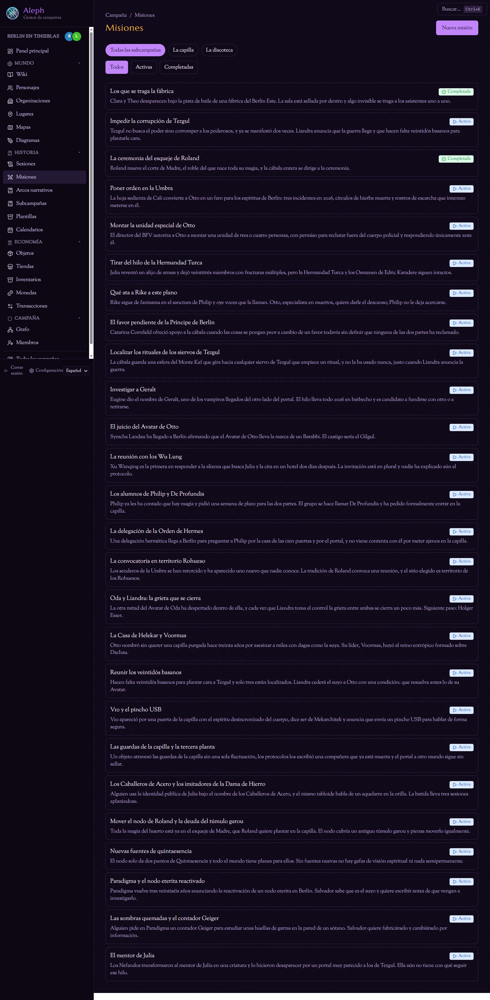
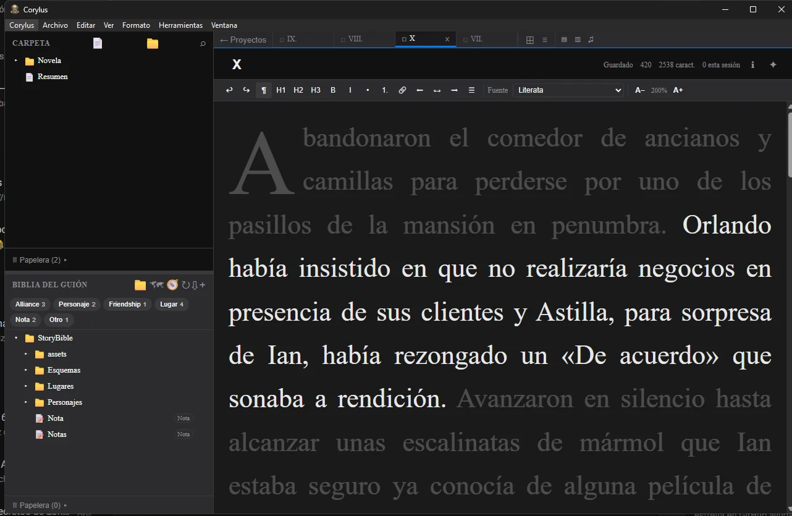

Work has been pretty rough these last few days and I barely have the energy to come home and do anything. Even so, I did end up getting something done, so the least I can do is put it down here.

First off, I'm about to finish the map of the Berlin in Darkness chantry. There's a single room left, still empty, and I'm waiting for my players to come up with some idea to fill it with. The truth is I'm happy with the result; it's certainly pretty eclectic, but I do think it captures each character's mindset well.

On another front, yesterday I was tinkering with a few things in Aleph, the software I wrote to document roleplaying campaigns. Specifically, I set up the quests (the things the characters have shown an interest in doing) with a short description and a long one, the short one so you can take them in at a glance from the list. Nothing too heavy, but genuinely useful given the volume of stuff already in Berlin in Darkness. We're talking about a hundred characters and dozens of locations with maps, all geolocated. Plenty of cloth to cut, so to speak.

Next on my plate is a small change to Corylus, the writing software I'm developing. This is actually the first time I've worked cross-platform, meaning a language compiled on Windows and on Mac, and I'm running into strange problems with paths and with the integration with sync tools like Dropbox or OneDrive. It's a tricky subject and, truth be told, a complex one, but there you go, one step at a time.

To finish off, we got in a couple of short hours of the Berlin in Darkness session and it went pretty well. My players met a woman looking for an old Geiger counter, and I took the chance to slip in a hook about some black silhouettes that have turned up in one of the abandoned stations of the Berlin metro. I also left the session with the group standing outside a neo-Nazi bar with police there and a guy dressed in a sort of armor cobbled together out of pieces, Shaquille O'Neal in [Steel](https://en.wikipedia.org/wiki/Steel_(1997_film)) style. My idea is to use it to expand the arc of the Iron Lady, one of the characters. We'll see how it goes :)
