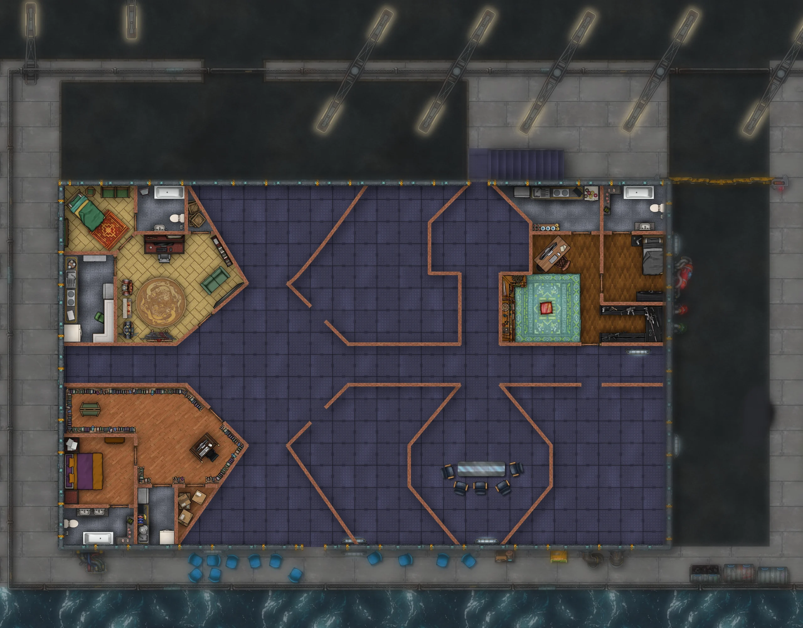

En los últimos cinco años me he acostumbrado a preparar los mapas de mis partidas de rol de mesa. En ocasiones tomo mapas ya creados, como los de [Forgotten Adventures](https://www.patreon.com/forgottenadventures) o [Tom Cartos](https://www.patreon.com/tomcartos), y en otras ocasiones me los creo yo mismo. A lo largo de estos años he usado, y sigo usando, de todo. Desde [Photoshop](https://www.adobe.com/products/photoshop.html) a [Clip Studio Paint](https://www.clipstudio.net/), pasando por [Dungeondraft](https://dungeondraft.net/), [DungeonFog](https://www.dungeonfog.com/) o lo que estoy utilizando en los últimos tiempos, [Inkarnate](https://inkarnate.com/). Pago varios [Patreon](https://www.patreon.com/), como el de TC Modern o en su momento el de Forgotten Adventures y uso sus mapas o me los creo con sus tokens.

Inkarnate es un software online que permite crear mapas de manera sencilla. O mejor dicho, de manera más sencilla que con Photoshop. Los resultados son bastante buenos y he estado trabajando con él en los últimos meses. Inkarnate tiene una ventaja adicional, y es que viene con un conjunto de dibujos, o tokens, que son maravillosos tanto para mapas de ciudades de fantasía como para battlemaps de fantasía, ciencia ficción o cyberpunk. Pero tiene un problema: no tiene tokens modernos, esto es, tokens que permitan hacer battlemaps para juegos ambientados en la actualidad. Por suerte hay una forma de solucionar este problema, y es que si eres un usuario Premium puedes subir tus propios tokens. Por desgracia ahí terminan las buenas noticias porque Inkarnate no tiene una API para subirlos de manera automática y la forma de crear estilos, catálogos y subir tokens es, digamos, muy manual y muy, muy, lenta. Lo sé de buena tinta, traté de subir unos cuantos paquetes de TC Modern y casi me volví loco de aburrimiento. Es lento, propenso a error y además a veces el sistema no funciona pero no queda claro por qué. Un drama de primer mundo, vamos. Por fortuna, esta mañana tenía tiempo así que me puse a trabajar en un par de programas que me ayudaran a solventar este problema.

Lo primero que quería era ser capaz de extraer los tokens de los paquetes de Dungeondraft de Tom Cartos. ¿Por qué? Como patreon podría descargarme zips con los ficheros PNG, pero quería tener también los tags que usa Tom Cartos en Dungeondraft. Así que lo que hice fue estudiar cómo lo hacía
[EightBitz's Dungeondraft Tools](https://github.com/EightBitz/Dungeondraft-Tools), que tiene una herramienta en [Visual Studio](https://visualstudio.microsoft.com/) para extraer datos. Leyendo el código aprendí que usa una variante del método de paquetes de [Godot Engine](https://godotengine.org/), así que preparé un programa en línea de comandos basado en [Rust](https://www.rust-lang.org/) que permite descomprimir paquetes de Dungeondraft completos. ¿Podría haber utilizado el de EightBitz? Pues sí, pero tenía muuuchos paquetes que descomprimir y quería aprender. Y después de un par de horas tuve la solución en un repo que os dejo por si queréis utilizarlo: [Reverse-engineered documentation of the Dungeondraft file formats](https://github.com/LudoBermejoES/dungeon-draft-rust-tools)

Pero eso era solo parte del problema. La otra parte es quizás más difícil y tiene que ver con cómo subir las imágenes descomprimidas a Inkarnate. Tengo poco tiempo y menos paciencia para las tareas repetitivas y, además, llevo muchos, muchos años pegándome con ordenadores. Así que aproveché mis viejos conocimientos de web scraping y los nuevos de e2e testing para preparar una serie de scripts para que me sirvieran para navegar la web de Inkarnate y crear carpetas primero y subir después los assets, o tokens. No os quiero aburrir demasiado con los detalles pero, si os interesa, podéis echar un vistazo en: [dungeon-draft-rust-tools/scripts at main](https://github.com/LudoBermejoES/dungeon-draft-rust-tools/tree/main/scripts)

Y ahora me preguntaréis, ¿cómo quedó la cosa? Pues veréis, este es un volcado de cómo quedó, después de ejecutar todo:

No está mal, ¿verdad? Y ahora igual entendéis a lo que me refería con hacerlo a mano. Imaginad ir creando decenas de carpetas, subcarpetas y demás, e ir subiendo una a una cada imagen. Agotador. Pero el resultado es bueno, estoy contento con él. Y además me ha permitido comenzar con el mapa, del que de momento tengo 3 habitaciones:

Así que no me puedo quejar.

Ahora, a preparar la partida de Alzarreyes de esta tarde, que me toca dirigir y como no tenga cuidado, va a ser una masacre, no sé si de mis jugadores o de los PNJs del juego.

Ya veremos.