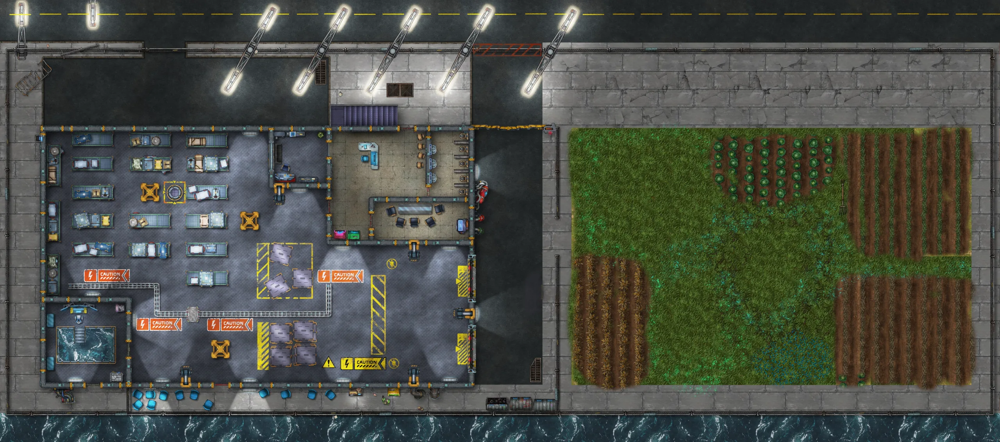

今日は面白い一日でした。私が主宰する文芸ワークショップ——ファンタジー、ホラー、SF といったジャンル小説の創作ワークショップです——では、SF における舞台設定のアイデアをいくつか扱いました。具体的には次のものです。

- サミュエル・R・ディレイニーと、舞台設定の手段としての言葉の使い方。「ドアが拡張した」は、たった一文で舞台設定の描写まるごとを先取りする、あるいはそれを消し去ってしまうことさえできる語りの形です。
- レイ・ブラッドベリと彼の名詞リスト。つまり、舞台設定を支えるために膨大な情報を作り込む代わりに、書き手の頭のなかで響く名詞のリスト（「踏切、空き地」）を用意しておくというやり方
- ジョルジュ・ペレックと場所の汲み尽くし。つまり、ある場所を汲み尽くすまで繰り返し見直すことで、アンフラオルディネールに到達できるということ。それは、前景にあるものと後景にあるものを書き留め終えるまでは見分けられないものです。

さらに、自分のロールプレイングのセッション用のフロアに、新しい部屋を2つ入れることができました。

ほかに語ることはあまりありません。仕事の詰まったこういう日々では、たいしたことはできないのです。ああ、違いました！小説に戻ることができました。朝のごく早い時間に 400語ほど書きました。多くはありませんが、作品のなかでも難しい章のひとつを書くために必要な地点へ、もう一度自分を連れ戻してくれる分量です。その章は、言ってみれば虚空への跳躍、あるいは主人公にとっての引き返せない道になるはずです。

というわけで、結局のところ、そんなに悪くはありません。
