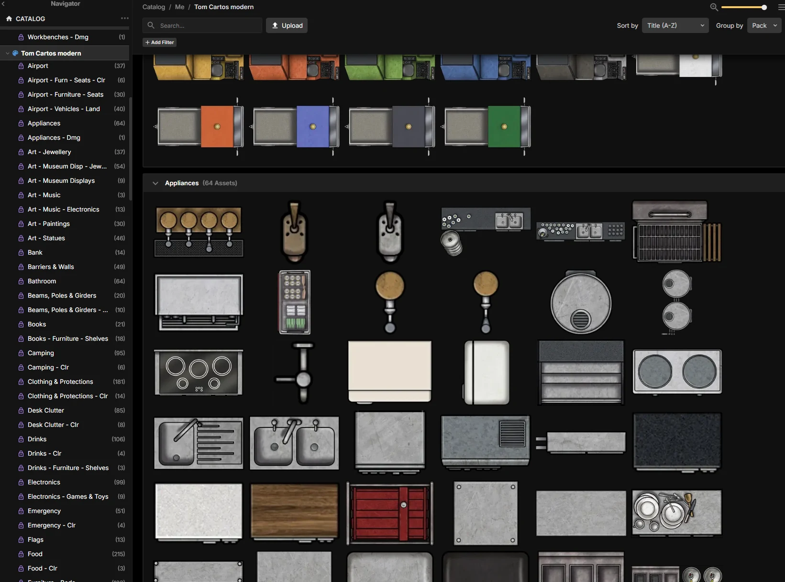

この五年ほどで、テーブルトーク RPG のセッションで使うマップは自分で用意するのが習慣になりました。[Forgotten Adventures](https://www.patreon.com/forgottenadventures) や [Tom Cartos](https://www.patreon.com/tomcartos) のように、すでに作られたマップをそのまま使うこともあれば、自分で作ることもあります。この数年のあいだ、ありとあらゆるものを使ってきましたし、今も使い続けています。[Photoshop](https://www.adobe.com/products/photoshop.html) から [Clip Studio Paint](https://www.clipstudio.net/)、その途中に [Dungeondraft](https://dungeondraft.net/) や [DungeonFog](https://www.dungeonfog.com/)、そしてここ最近使っている [Inkarnate](https://inkarnate.com/) まで。[Patreon](https://www.patreon.com/) にもいくつか課金していて、TC Modern や、当時は Forgotten Adventures のものがそうです。そして彼らのマップを使ったり、彼らのトークンで自分のマップを作ったりしています。

Inkarnate は、マップを手軽に作れるオンラインソフトウェアです。いや、正確に言うなら、Photoshop よりは手軽に、ということですが。出来上がりはなかなか良く、ここ数か月はこれで作業しています。Inkarnate にはもう一つ利点があります。イラスト、つまりトークンのセットが付属していて、これがファンタジー都市の地図にも、ファンタジーや SF、サイバーパンクのバトルマップにも素晴らしく使えるのです。ただし問題もあります。現代物のトークンがない、つまり現代を舞台にしたゲーム用のバトルマップを作れるトークンがないのです。幸い、この問題を解決する方法はあります。Premium ユーザーであれば、自分のトークンをアップロードできるのです。残念ながら、良い知らせはそこまでです。Inkarnate には自動でアップロードするための API がなく、スタイルやカタログを作ってトークンをアップロードする手順は、言ってみれば、きわめて手作業で、とても、とても遅いのです。身をもって知っています。TC Modern のパックをいくつかアップロードしようとして、退屈のあまり気が狂いそうになりました。遅く、ミスも起きやすく、おまけに時々システムが動かなくなるのに、その理由がはっきりしません。まあ、典型的なぜいたくな悩みです。幸い、今朝は時間があったので、この問題を解決してくれるプログラムを二つ作り始めました。

まず欲しかったのは、Tom Cartos の Dungeondraft パックからトークンを取り出せるようにすることでした。なぜか。Patreon の支援者なので PNG ファイルの入った zip をダウンロードすることはできるのですが、Tom Cartos が Dungeondraft で使っているタグも一緒に手に入れたかったからです。そこで私がやったのは、
[EightBitz's Dungeondraft Tools](https://github.com/EightBitz/Dungeondraft-Tools) がどうやっているのかを調べることでした。これはデータを取り出すためのツールを [Visual Studio](https://visualstudio.microsoft.com/) 上に持っています。コードを読んで、[Godot Engine](https://godotengine.org/) のパッケージ方式の変種を使っていると分かったので、Dungeondraft のパックを丸ごと展開できる [Rust](https://www.rust-lang.org/) 製のコマンドラインプログラムを用意しました。EightBitz のものを使えばよかったのでは？たしかに使えました。でも展開したいパックがたーーくさんありましたし、自分でも学びたかったのです。そして二時間ほどで解決策ができました。使ってみたい方のために、リポジトリを置いておきます。[Reverse-engineered documentation of the Dungeondraft file formats](https://github.com/LudoBermejoES/dungeon-draft-rust-tools)

しかし、これは問題の一部にすぎません。もう一方はおそらくもっと難しく、展開した画像をどうやって Inkarnate にアップロードするか、という話です。私には時間があまりなく、繰り返し作業への忍耐はもっとありません。そのうえ、長い、本当に長い年月をコンピューターと格闘して過ごしてきました。そこで、昔取ったウェブスクレイピングの知識と、新しく身につけた E2E テストの知識を活かして、Inkarnate のサイトを渡り歩き、まずフォルダーを作り、次にアセット、つまりトークンをアップロードするためのスクリプト群を用意しました。細かい話であまり退屈させたくはありませんが、興味があればこちらをのぞいてみてください。[dungeon-draft-rust-tools/scripts at main](https://github.com/LudoBermejoES/dungeon-draft-rust-tools/tree/main/scripts)

さて、結果はどうなったのかと聞かれるでしょう。では、ひととおり実行し終えたあとの様子がこちらです。

悪くないでしょう？これで、手作業でやるというのがどういうことか分かってもらえたかもしれません。数十個のフォルダーやサブフォルダーを一つずつ作り、画像を一枚ずつアップロードしていくところを想像してみてください。うんざりします。でも結果は良く、気に入っています。おかげでマップの制作にも取りかかれました。いまのところ部屋が3つできています。

というわけで、文句は言えません。

さて、今日の午後の Alzarreyes のセッションの準備です。マスターをするのは私の番で、気をつけないと虐殺になります。私のプレイヤーたちの虐殺になるのか、ゲームの NPC の虐殺になるのかは分かりませんが。

どうなるでしょうか。
