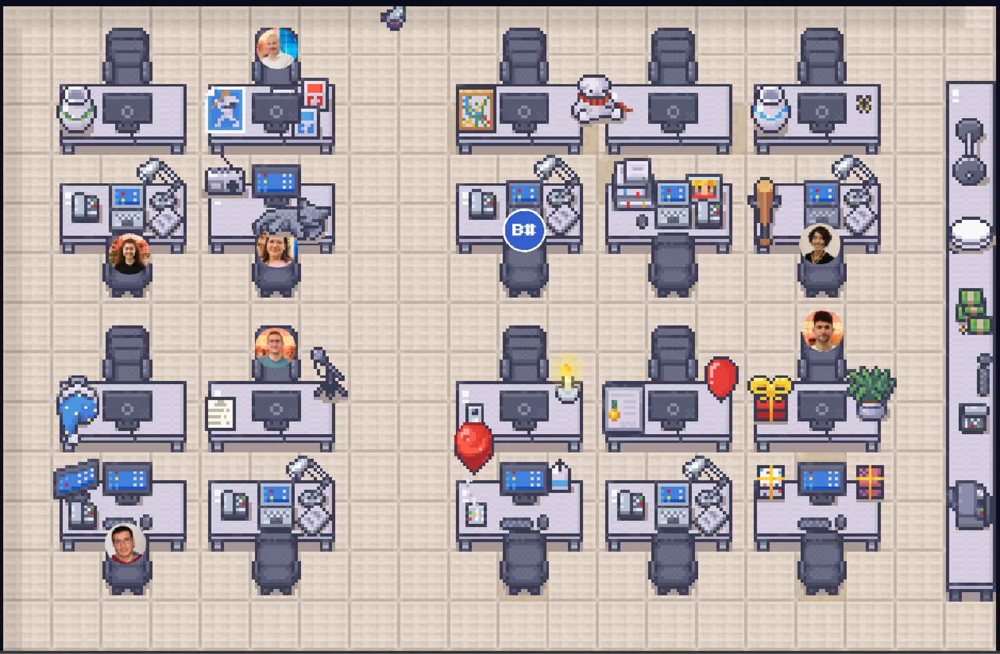
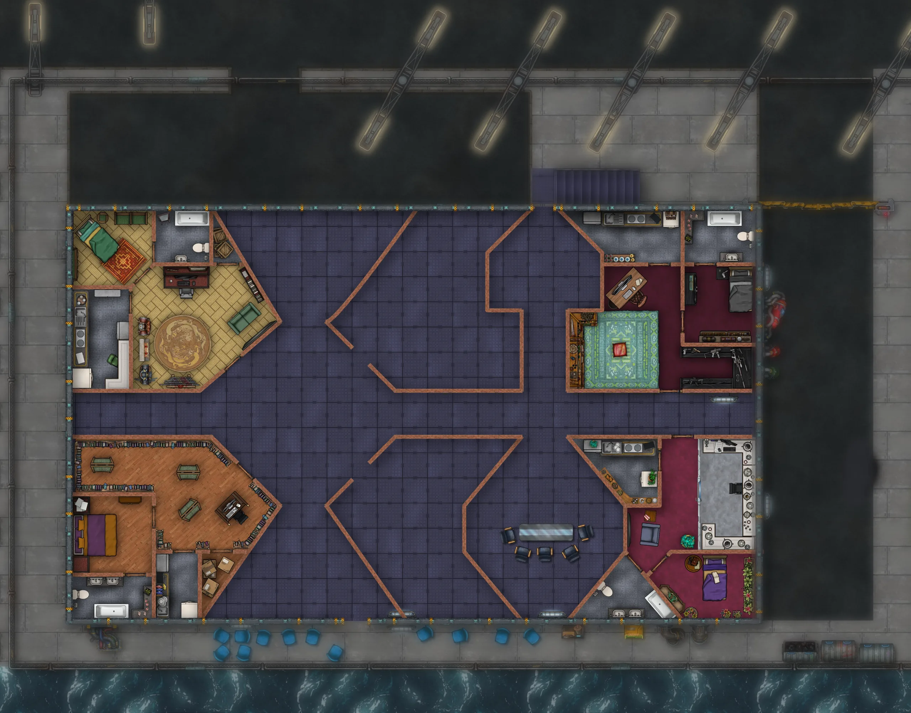

今日は手短に。もう遅い時間なので。特筆することはあまりなく、仕事はぱっとしない一日で、何かをする時間はほとんど残りませんでしたが、少なくとも、オフィス用に作ったちょっとしたプログラムに手を入れることはできました。同僚たちが実際に建物へ出てくるときに、自分の席を選べるようにするものです。画像はこちらでご覧いただけます。

ダウンロードはこちらからできます：[https://github.com/LudoBermejoES/virtual\_office](https://github.com/LudoBermejoES/virtual_office)

それに加えて、いま取り組んでいるマップも、もう少しだけ進めました。まだやることは残っていますが、もう一部屋できあがりました。「闇のベルリン」のキャンペーンの登場人物の一人、Oda の部屋です。わずかな前進ですが、少なくとも何かの役には立ちました。

小説の新しい章は進められませんでした。朝早くから仕事を始めたからです。そしてそれが気がかりです。ペースを取り戻すのに苦労しています。でも、自分でどうにかできることでもないので、いまのところはこれでよしとするしかありません。
