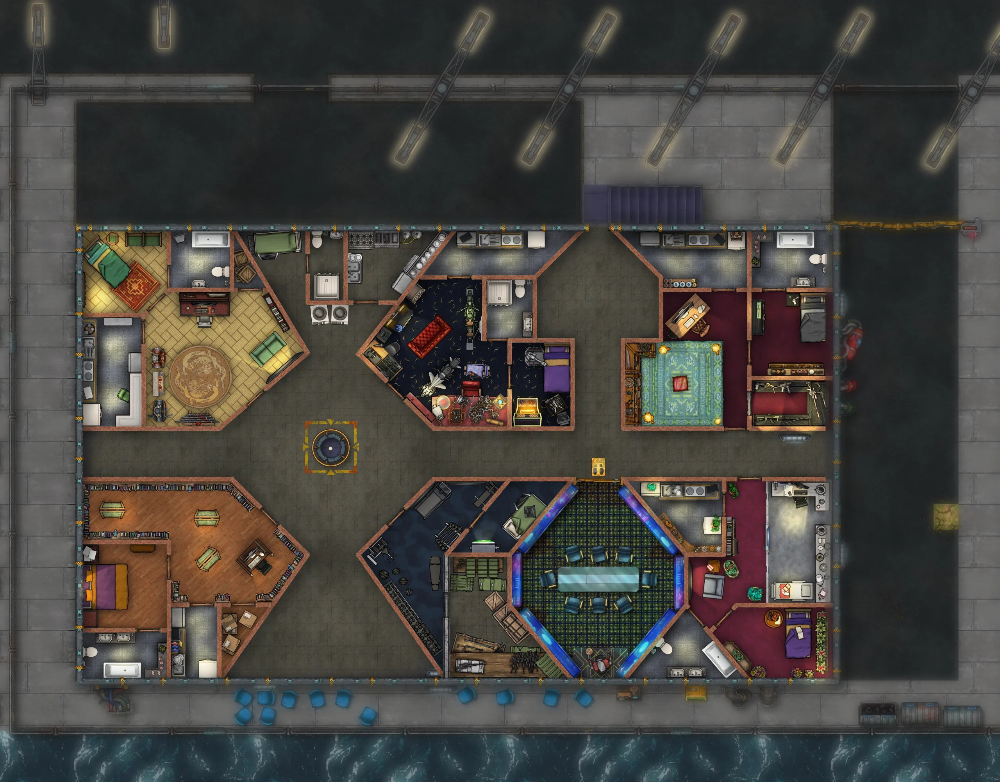

요즘 회사 일이 꽤 빡빡해서 집에 돌아와 뭔가를 할 기운이 거의 남지 않습니다. 그래도 결국 뭔가는 해내긴 했으니, 여기에 적어 두기라도 해야겠습니다.

먼저, “어둠 속의 베를린”의 챈트리 맵이 거의 다 끝나 갑니다. 아직 비어 있는 방이 딱 하나 남았는데, 그 방을 무엇으로 채울지 제 플레이어들이 아이디어를 내 주기를 기다리는 중입니다. 결과물은 사실 마음에 듭니다. 꽤 잡다하긴 하지만, 그래도 각 등장인물의 사고방식을 잘 드러내 준다고 생각합니다.

한편 어제는 롤플레잉 캠페인을 기록하려고 제가 직접 만든 소프트웨어인 Aleph를 이것저것 손봤습니다. 구체적으로는 퀘스트(등장인물들이 하고 싶다고 관심을 보인 일들)에 짧은 설명과 긴 설명을 붙일 수 있게 준비했습니다. 짧은 쪽은 목록에서 한눈에 훑어볼 수 있도록 하기 위한 것입니다. 그리 대단한 작업은 아니지만, “어둠 속의 베를린”에 이미 쌓여 있는 양을 생각하면 정말 쓸모가 있습니다. 등장인물이 백 명 남짓에 맵이 딸린 장소가 수십 곳, 게다가 전부 위치 정보가 붙어 있습니다. 말하자면 손댈 거리가 아주 많습니다.

다음으로 책상 위에 올라와 있는 일은 제가 개발 중인 집필 소프트웨어 Corylus의 자잘한 수정입니다. 사실 크로스 플랫폼 작업은 이번이 처음입니다. 그러니까 Windows와 Mac 양쪽에서 컴파일되는 언어를 쓰는 건데, 경로 문제와 Dropbox나 OneDrive 같은 동기화 도구와의 연동에서 이상한 문제를 겪고 있습니다. 까다로운 주제이고 실제로도 복잡하지만, 뭐 조금씩 해 나가야지요.

마지막으로, “어둠 속의 베를린” 세션을 두어 시간쯤 돌렸는데 꽤 괜찮았습니다. 제 플레이어들은 오래된 가이거 계수기를 찾고 있는 여자를 만났고, 저는 그 틈을 타 베를린 지하철의 버려진 역 가운데 한 곳에 나타난 검은 실루엣 떡밥을 슬쩍 깔아 두었습니다. 게다가 세션을 마무리한 지점은 일행이 네오나치 바 앞에 서 있는 장면이었습니다. 경찰들이 있고, 조각을 이어 붙여 만든 듯한 갑옷 비슷한 것을 걸친 남자도 하나 있습니다. [Steel](https://en.wikipedia.org/wiki/Steel_(1997_film))의 샤킬 오닐 같은 모습이지요. 제 생각은 이 기회를 살려 등장인물 가운데 하나인 철의 여인의 이야기 아크를 넓혀 보는 것입니다. 어떻게 될지 두고 봐야지요 :)
