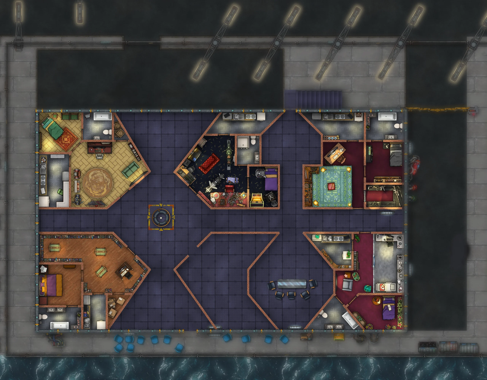

今天是有意思的一天。在我主持的文学工作坊上——一个类型文学写作工作坊（奇幻、恐怖、科幻）——我们讨论了科幻里营造设定的几种思路，具体来说：

- 塞缪尔·R·德拉尼（Samuel R. Delany），以及把用词本身当作营造设定的手段。“门扩张开了”是这样一种写法：只用一句话，就能引出、甚至直接省去整段设定描写。
- 雷·布拉德伯里（Ray Bradbury）和他的名词清单，也就是如何准备一份能在作者脑子里产生共鸣的名词清单（“铁路道口”“空地”），用它来代替堆砌大量信息去服务设定
- 乔治·佩雷克（Georges Perec）和“地点的穷尽”，也就是如何通过把一个地方反复审视到穷尽，抵达“次日常”——次日常就是那些只有在你把前景和背景里的东西都记下来之后，才能分辨出来的部分。

另外，我还在跑团那张楼层图上塞进了两个新房间。

别的没什么好讲的，这些天工作强度大，也挤不出多少事情来。啊，我说错了！我总算回到了小说上，一大早写了四百来字，不算多，但足以让我重新回到需要的那个位置，去写这部作品里比较难的一章——这一章可以说就是纵身跃入虚空的一刻，或者说，是主角那条再也回不了头的路。

所以说到底，也不算太糟。
